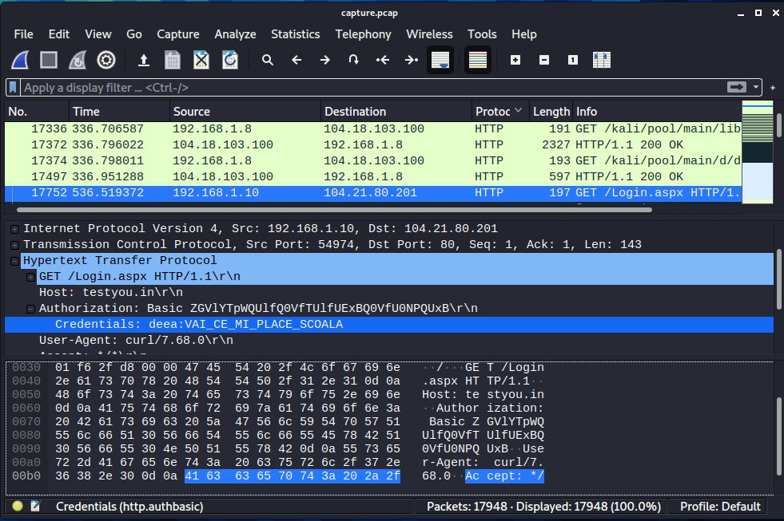
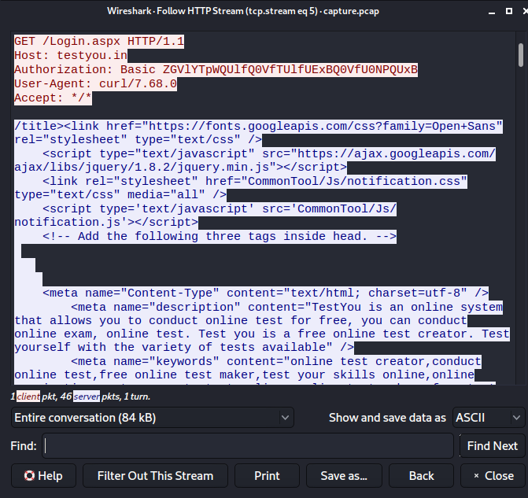

# MitM-ARP-Spoofing
This is a PoC of the MitM ARP Spoofing attack for the course Security Protocols.

# Attack
ARP Spoofing is a MitM attack in which the attacker sends forged ARP messages.
This fools the victim that the attacker is a legitimate user, by linking the
attacker's MAC address to a legitimate ip address.

The attack works as it follows:
1. The attacker scans the network to find the ip address of the victim and the
gateway
2. The attacker starts sending forged ARP responses
3. The forged responses tell the gateway and the victim that the attacker's
MAC address is the correct one and both, the gateway and victim, connect to
the attacker's machine instead of each other
4. The ARP cache entries are updated and the attacker can intercept the traffic
between victim and router.

# Topology
For this PoC we used a Kali Linux 2020.4 machine for the attacker and a Ubuntu 
20.10 machine for the victim:
* Attacker - ip address: 192.168.1.8/24
* Victim - ip address: 192.168.1.10/24 
* Gateway - ip address: 192.168.1.1/24 

# Attacker
The first thing to be done on the attacker's machine is to enable ip forwarding
using the following command:
```
sysctl -w net.ipv4.ip_forward=1
```
This way, when the attacker receives packets from the victim, they will be then
forwarded to the destination ip address.

Next, the attacker will start analyzing the network traffic and all the packets
that are created or received by the attacker will be captured within a file that
will be used at the end of the attack. This is done by using the *tcpdump*
command as it follows:
```
tcpdump -i eth0 -Z root -w capture.pcap
```

Finnaly, the attacker can start the ARP spoofing. By running the following commands
the attacker captures the traffic victim -> router and router -> victim. 

```
sudo arpspoof -i eth0 -t 192.168.1.10 192.168.1.1 > /dev/null 2> /dev/null &

sudo arpspoof -i eth0 -t 192.168.1.1 192.168.1.10 > /dev/null 2> /dev/null &
```


# Victim
From the victim machine we can start sending HTTP requests. We choosed the
[TestYou](http://testyou.in/Login.aspx) platform as it is using standard HTTP and all the information
is sent in clear text.
For this we used the curl command as it follows:
```
curl -u deea:VAI_CE_MI_PLACE_SCOALA http://testyou.in/Login.aspx
```

## Attention! 
After the attack, make sure to close the tcpdump process, otherwise the
capture will not be saved!

# Results
To check that the attack worked we used a tool called [Wireshark](https://www.wireshark.org/).
The file that contains the captured packets, *capture.pcap*, is added to
Wireshark and we will filter the data so that we can see only the HTTP stream.
Now we get the one containin the GET request and, as we can see from the
fallowing two images, we can detect the username and password and we can 
get the page result as well.

